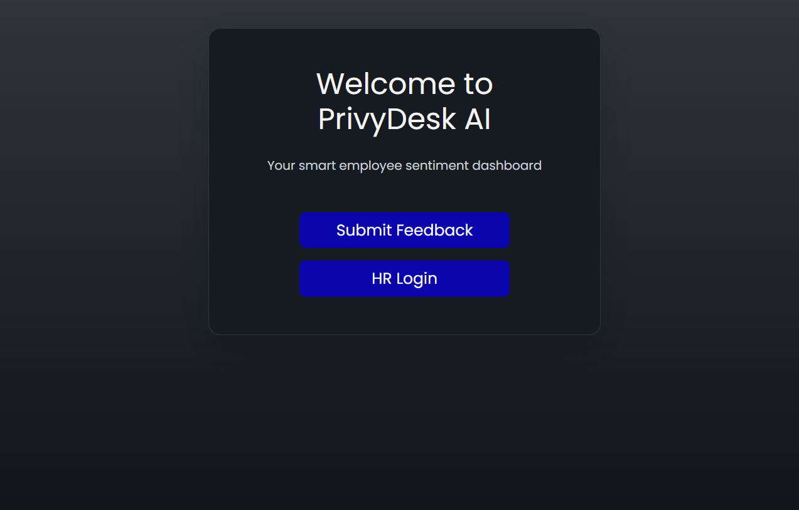
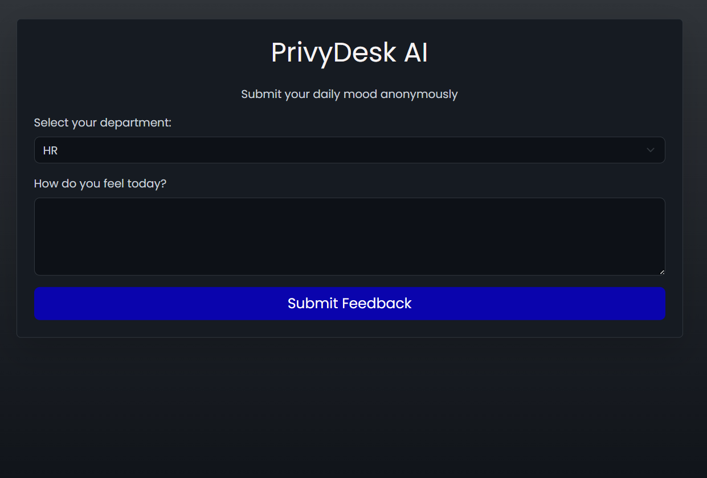
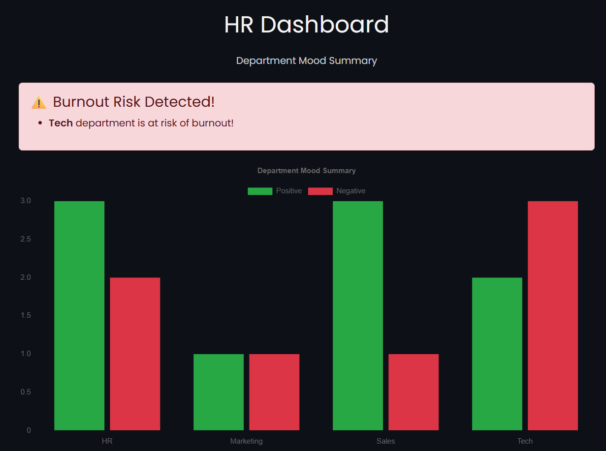

PriviDesk AI

PriviDesk AI is a smart, web-based employee sentiment dashboard designed to promote mental health awareness in the IT industry.
It allows employees to anonymously submit daily feedback about their mood, helping organizations track department-wise sentiments and proactively address burnout.

🌱Why This Project?

In the fast-paced IT sector, mental health is often overlooked.
PriviDesk AI is a step towards creating a more empathetic workspace by enabling anonymous, sentiment-based feedback to help HR detect burnout trends early.

## 🚀 Core Features
- Anonymous employee feedback submission
- Real-time department mood summary dashboard for HR
- Sentiment analysis using Hugging Face NLP model
- Secure HR login
- Alerts for potential burnout based on negative sentiment spikes

## 📸 Screenshots

### 🔹 Landing Page

### 🔹 Feedback Form

### 🔹 HR Dashboard

---

## 🔧 Tech Stack

- **Backend:** Python, Flask
- **Frontend:** HTML, CSS, Bootstrap
- **AI Model:** Hugging Face Sentiment Analysis
- **Database:** SQLite

---

How to Run Locally
1.Clone the repository:
git clone https://github.com/shahinasalimm/PriviDesk-AI.git
cd PriviDesk-AI
2.Install dependencies:
pip install -r requirements.txt
3.Run the Flask app:
python app.py
4.Open your browser and navigate to:
http://localhost:5000/
